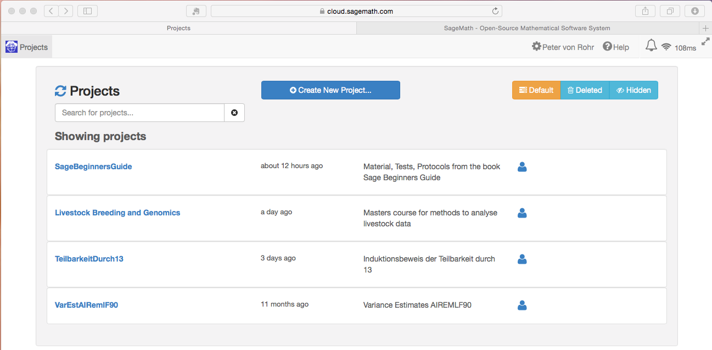
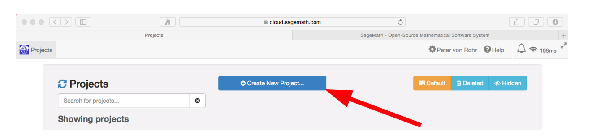
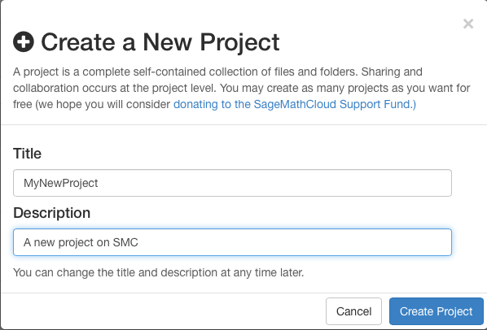

```{r, echo=FALSE}
### # status information about publication status and image links
sStatus <- "draft"
sImageSourceDir <- "pic"
sImageBaseUrl <- "http://charlotte-ngs.github.io/img/2015-05-07-ComputationMeetsTheCloud"
```

This post introduces the potential synergies of computer algebra and cloud computing.

## Terminology
`Computer algebra systems` (CAS) are software programs that are able to manipulate symbolic mathematical formulas. CAS clearly specialize in symbolic computation which sets them apart from the systems that are mainly used for numeric computation such as `Matlab`, `R`, `Julia` and others. 

## History
The development of CAS started in the 1960s. Currently `Maple` and `Mathematica` are the most widely known CAS. The were first released in the 1980s. [Wikipedia](http://en.wikipedia.org/wiki/Computer_algebra_system) gives a nice overview of CAS and their history. 

## Technical Aspects
Traditionally CAS like many other tools are installed as standalone applications on local computers. This imposes high costs of resources on development teams to ensure portability across all different computer platforms.

With the advent of cloud computing where applications do not have to be installed on local computers, but applications can be used through a web interface, this has changed dramatically. Google with their email, calendar and office applications was certainly a driving force in this development. 

[`SageMath`](http://www.sagemath.org) which is a relatively young CAS is going the same route as Google with their office applications. Instead of porting the system to all platforms, the SageMath team came up with a web front end which is called [SageMathCloud](http://cloud.sagemath.com). SMC is like SageMath completely free. All it requires is to sign up for an account. 

## Getting Started With SMC
As soon as one has signed up for an account on SMC, one is ready to sign in and SMC presents the starting page which is initially empty. The screen shot below shows a starting page with already existing projects. 



When logging in for the first time, the only thing that can be done is creating a new project by hitting the `Create New Project...` button in the middle of the page (see screen shot below). 



After clicking the `Create New Project...` button, a popup appears where the user has to specify the name of the new project and its description.



Inside a project, one can either create or upload files or one can add collaborators to the project. SMC allows you to create very different types of files. Those types can be

* Sage worksheet
* Terminal
* Jupyter notebook
* LaTeX document
* Markdown document
* Task List
* Course
* Sage program file
* Phython program
* Folder

Appearently, SMC holds up the old unix tradition that really everything is a file.


