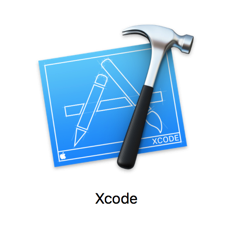
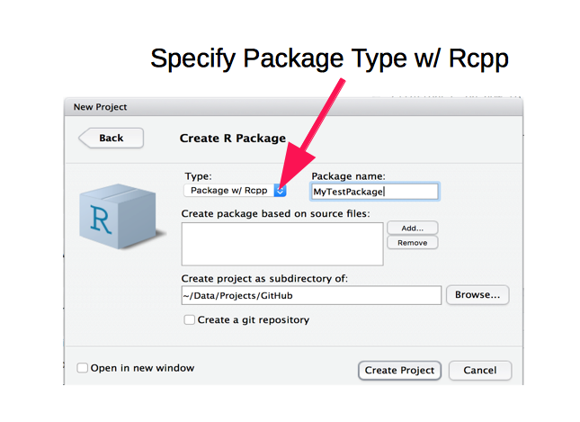
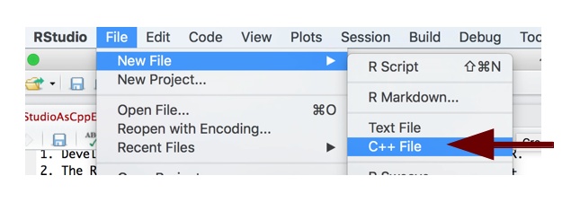

# Disclaimer
The aim of this post is to see whether RStudio can be used as an IDE for C/C++

# Introduction
C++ is a widely used compiled language. As in any other compiled language, software development is structured as a write-compile-link-executed-debug loop. Except for the writing part, IDEs (Integrated Development Environments) can help software developers to ease the burdon of all other steps of the development cycle. 

## Known IDEs for C++
The choice of IDE can depend on the operating system on which the programs are written and executed. On Mac OS X, XCode is probably the most widely used IDE. 



On Linux there is Kdevelop coming with the KDE window manager. DevC++ is a very convenient and light-weigt IDE on windows. Eclipse CDT is a version of Eclipse specially tailored for C++ development that can be used on any of the mentioned platforms. 


## Downside of IDEs
The downside of most IDEs is that they are rather heavy weight. Most users who just want to write small command line programs are lost in the massive number of features offered by the described IDEs. 


# Alternatives
Alternatives to heavy-weight IDEs are slim editors like TextWrangler on the Mac or Notepad++ on Windows. Those editors provide a small set of functionalities but it feels that they are easier to use than the large-scale IDEs. 


# RStudio - a small IDE
Recently, RStudio has become quite well known in the community of R developers. Since R has several interfaces to be used with C/C++ it is quite likely that R developers also write C/C++ code. 

The aim of this post is to make a few tests and check how useful RStudio might be as an IDE for C/C++. Our tests are based on a few assumptions which might affect the relevance of the tests and the usefulnes of this post. Here are our assumptions

1. Development of C/C++ code using RStudio cannot be done without R. 
2. The R package ``Rcpp'' is required to bridge between R and C/C++
3. Software programs are organized in projects and the structure of a project is determined by the R package functionality


# First Steps
The easiest way to start a C/C++ - project with RStudio is to create a new R-package and thereby selecting the option ``with Rcpp''. 



This automatically creates the directory "src" inside the project directory. Inside that "src" directory there are two files called "rcpp_hello.cpp" and "RcppExports.cpp". These files contain some "Hello-World" example code in C++. The content of "rcpp_hello.cpp" is shown below

```{r, echo=FALSE, results='asis'}
sHwCppFn <- "../src/rcpp_hello.cpp"
sHwCpp <- readLines(sHwCppFn)
cat("```\n")
cat(sHwCpp, sep = "\n")
cat("```\n")
```


## Call to rcpp_hello()
The function "rcpp_hello()" can be called from the R console using the function "sourceCpp()" which makes the content of the source file "rcpp_hellp.cpp" available to the R system. 

```{r RunRcppHello}
Rcpp::sourceCpp(sHwCppFn)
rcpp_hello()
```

Alternatively, we can load the content of the whole R-package using function "load_all()" from package "devtools".

# Create Your Own
Running the "Hello World" example is fine at the beginning, but we are definitely aiming at something more interesting. We want to write our own functions. This can be done by adding a new ".cpp" file. New ".cpp" files can be added by clicking on "File > New > C++-File" as shown on the screen-shot below



This creates an empty file with an example function which looks as follows.

```{r, echo=FALSE, results='asis'}
sTimesTwoCpp <- readLines("../src/rcpp_timestwo.cpp")
cat("```\n")
cat(sTimesTwoCpp, sep = "\n")
cat("```\n")
```

The content of this file can be adjusted according to our needs. Then the file with the new C++ source code is saved under a different name. As an example, we can create a C++ function called "vecSquare(x)". The function "vecSquare(x)" computes the scalar square of its argument "x". This function might look as follows.

```{r, echo=FALSE, results='asis'}
sVecSquareCppFn <- "../src/rcpp_vecSquare.cpp"
sVecSquareCpp <- readLines(sVecSquareCppFn)
cat("```\n")
cat(sVecSquareCpp, sep = "\n")
cat("```\n")
```

The following statement calls function "vecSquare()" with two different arguments.

```{r RunVecSquare}
Rcpp::sourceCpp(sVecSquareCppFn)
vecSquare(41)
vecSquare(c(1:3))
```


# 
