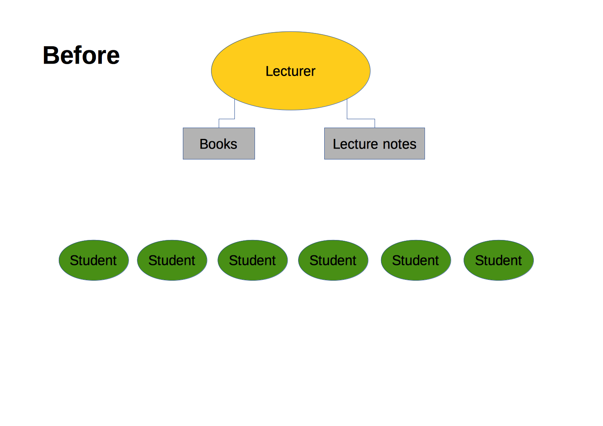
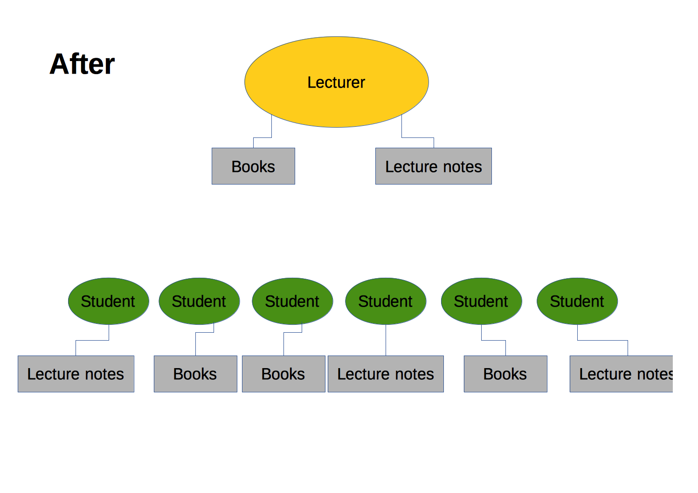

The advent of new technologies have changed our lives and hence also the way we teach. Connected to all the bright new technologies and the fancy tools that have become available, there is the danger that they take the center of the action. Lecturers and students must be aware that the center of teaching activity has to remain the transfer of knowledge from lecturers to students and the gain of understanding of a subject by students. Technologies and tools are only helpers in the second row which support teachers and students to achieve their primary goals.

The next section compares how teaching courses was twenty-five years ago compared to what it is today. One significant change is the availability of technical tools such as `SageMathCloud`. For those of you who are not interested in the historical part, you can safely skip to the section on technical tools.


## History and Backgroud
### The Old Days
When I went to gradschool in the late eighties and early ninties, there was no powerpoint and there were no beamers. Some lecturers sold books or course-notes at the beginning of the semester containing all the required material which had to be digested until the final exam. Other lecturers required students to take notes from what they write on the blackboard or on the over-head projector. In essence the lecturer and his material were the only relevant authority with respect to the required material (see image below). The only place students and lecturers would meet was the class room. 

```{r, echo=FALSE, fig.show='asis'}
# 
DiagrammeR::grViz(" 
  digraph lecturer_and_students {

    # graph, node, and edge definitions
    graph [nodesep = .5, ranksep = .75]
  
    edge [color = grey, arrowhead = none, arrowtail = none]
    
    # subgraph for lecturer
    lecturer [style = filled,
              fillcolor = Gold,
              label = \"Lecturer\"];
  
    # books and lecture nodes
    node [shape = box,
          style = filled,
          fillcolor = LightGray,
          label = \"Books\"];
    book;
    node [shape = diamond,
          style = empty,
          label = \"Class Room\"];
    classroom;
    node [shape = box,
          style = filled,
          fillcolor = LightGray,
          label = \"Lecture Notes\"];
    lecture_notes;
  
    # students
    node [shape = oval, 
          width = .75, 
          height = .5, 
          style = filled, 
          fillcolor = LimeGreen, 
          label = \"Student\"]
    student1;
    student2;
    student3;
    student4;
    student5;
  
    # edges
    lecturer -> book;
    lecturer -> classroom;    
    lecturer -> lecture_notes;
    classroom -> {student1 student2 student3 student4 student5}
  } 
    
")
```

After the first week or so students were required to either buy the lecture notes or some books. In the example shown below, two students bought some of the recommended books and three of them baught lecture notes. Hence the physical material was distributed from the one source to many receipients.


```{r, echo=FALSE, fig.show='asis'}
# 
DiagrammeR::grViz(" 
  digraph lecturer_and_students {

    # graph, node, and edge definitions
    graph [nodesep = .5, ranksep = .75]
  
    edge [color = grey, arrowhead = none, arrowtail = none]
    
    # subgraph for lecturer
    lecturer [style = filled,
              fillcolor = Gold,
              label = \"Lecturer\"];
  
    # books and lecture nodes
    node [shape = box,
          style = filled,
          fillcolor = LightGray,
          label = \"Books\"];
    book;
    node [shape = diamond,
          style = empty,
          label = \"Class Room\"];
    classroom;
    node [shape = box,
          style = filled,
          fillcolor = LightGray,
          label = \"Lecture Notes\"];
    lecture_notes;

    # students
    node [shape = oval, 
          width = .75, 
          height = .5, 
          style = filled, 
          fillcolor = LimeGreen, 
          label = \"Student\"]
    student1;
    student2;
    student3;
    student4;
    student5;
  
    # edges
    lecturer -> book;
    lecturer -> classroom;    
    lecturer -> lecture_notes;
    classroom -> {student1 student2 student3 student4 student5};
    lecture_notes -> {student1 student3 student5};
    book -> {student2 student4};
  } 
    
")
```


### Today
Nowadays, the whole situation is much more flat and less hierarchical. The knowledge authority is distributed between the lecturer and the new source of information stored somewhere in the world-wide web (see figure below). 

```{r, echo=FALSE, fig.show='asis'}
DiagrammeR::grViz(" 
  digraph lecturer_and_students_and_web {

    # graph, node, and edge definitions
    graph [nodesep = .5, ranksep = .75]
  
    edge [color = grey, arrowhead = none, arrowtail = none]
    
    # subgraph for lecturer
    lecturer [style = filled,
              fillcolor = Gold,
              label = \"Lecturer\"];
  
    # books and lecture nodes
    node [shape = box,
          style = filled,
          fillcolor = LightGray,
          label = \"Books\"];
    book;
    node [shape = diamond,
          style = empty];
    classroom [label = \"Class Room\"];
    web       [label = \"World-Wide Web\"];
    node [shape = box,
          style = filled,
          fillcolor = LightGray];
    lecture_notes [label = \"Lecture Notes\"];
    online_notes  [label = \"Online Notes\"];

    # students
    node [shape = oval, 
          width = .75, 
          height = .5, 
          style = filled, 
          fillcolor = LimeGreen, 
          label = \"Student\"]
    student1;
    student2;
    student3;
    student4;
    student5;
  
    # edges
    lecturer -> book;
    lecturer -> classroom;    
    lecturer -> lecture_notes;
    classroom -> {student1 student3 student5};
    lecture_notes -> {student1  student5};
    book -> student2;
    web -> {lecturer classroom lecture_notes book online_notes
            student1 student2 student3 student4 student5};
    online_notes -> {student1 student4};
  } 
    
")
```


## Technical Tools Like SageMathCloud
From the above figure it is clear that the world-wide web takes a central role in teaching. Besides just being a storage where information can be published, it also provides great tools which support teaching activities.

### SageMathCloud
One such tool is SageMathCloud (SMC). SMC is based on Sage which is developed by William Stein as an open source alternative to Maple, Mathematica, Magma, and MATLAB. It started out as a standalone application, but very soon, it also provided a version in the cloud which is termed SMC. The advantage of SMC is its very advanced collaborative features such as synchronous editing of so-called Sage worksheets. In principle Sage worksheets are the program source files for the Sage language. A second advantage of SMC is that it can be evaluated, tested and used without installing anything at all. The only requirements for SMC is a browser and a connection to the internet. This is extremely convenient for MS windows users, because the Sage application can only be used inside a virtual machine which is a little cumbersome to get it to fly. 

